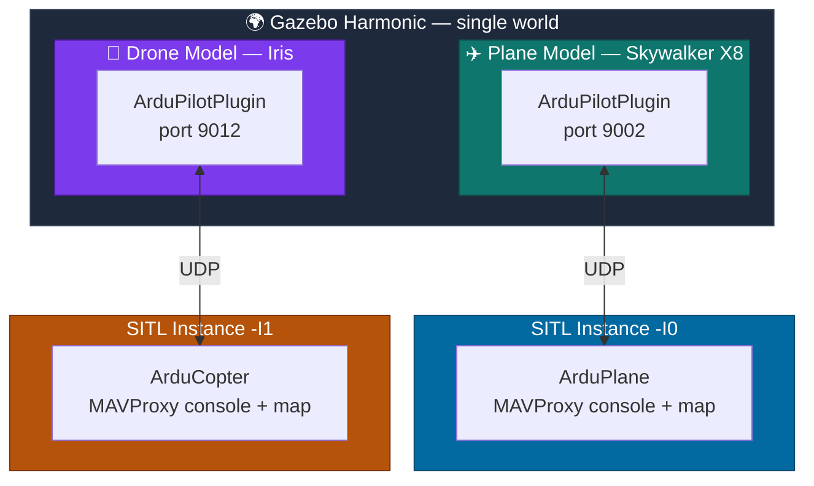

<div align="center">

# 🛩️🚁 Multi-Vehicle SITL Simulation
### Plane + Drone, Simultaneously, in One Gazebo Harmonic World


*A reference setup for running an ArduPlane fixed-wing aircraft and an ArduCopter multirotor together in the same simulated world, each bound to its own independent SITL instance — for coordinated multi-vehicle missions.*

</div>

---

## 📖 Table of Contents

- [Architecture Overview](#-architecture-overview)
- [Prerequisites](#-prerequisites)
- [Repository Structure](#-repository-structure)
- [Setup Steps](#-setup-steps)
- [Launching the Simulation](#-launching-the-simulation)
- [Troubleshooting](#-troubleshooting)
- [Notes](#-notes)

---

## 🏗️ Architecture Overview

Both vehicles live in **one Gazebo world**, but each runs its own `ArduPilotPlugin` bound to a unique UDP port, talking to its own SITL process. The two SITL instances never talk to each other directly — coordination happens at the mission/GCS layer above them.



**Key design points:**

| Concept | Detail |
|---|---|
| 🔌 Port convention | `9002 + (10 × instance number)` — plane uses `9002` (`-I0`), drone uses `9012` (`-I1`) |
| 🧭 Pose separation | Each vehicle gets a distinct `<pose>` in the world file so spawn geometry doesn't overlap |
| 🔁 Port isolation | `-I0` / `-I1` auto-offset each SITL's MAVLink/GCS/telemetry ports too — no manual conflict handling needed there |
| 🧩 Independence | Each SITL instance is a fully separate process with its own console + map window |

---

## ✅ Prerequisites

- [ ] **Gazebo Harmonic** installed and working (`gz sim` runs successfully)
- [ ] **ArduPilot** source built with working SITL (`sim_vehicle.py` available)
- [ ] **ardupilot_gazebo** plugin built, with `GZ_SIM_SYSTEM_PLUGIN_PATH` and `GZ_SIM_RESOURCE_PATH` correctly set
- [ ] Both vehicle models (plane + drone) already verified working **individually** before combining
- [ ] World/model resource paths added to `GZ_SIM_RESOURCE_PATH`

---

## 📁 Repository Structure

> Paths below are illustrative placeholders — adjust to match your actual layout.

```
<repo_root>/
├── worlds/
│   └── multi_vehicle_runway.sdf        # combined world (plane + drone + runway)
├── models/
│   ├── skywalker_x8/                   # plane model  (port 9002, untouched)
│   └── iris_I1/                        # drone model copy (port changed → 9012)
├── params/
│   ├── skywalker_x8.param              # plane ArduPilot parameters
│   └── gazebo-iris-gimbal.parm         # drone ArduPilot parameters
└── README.md
```

---

## 🛠️ Setup Steps

### 1️⃣ Duplicate the drone model for a second SITL instance

Vehicle models default to `fdm_port_in = 9002` — the same port the plane already uses. Copy the drone model so the two don't collide:

```bash
cp -r <path_to_original_iris_model> <path_to_iris_model>_I1
```

Edit the copy's `model.sdf`:

```diff
- <fdm_port_in>9002</fdm_port_in>
+ <fdm_port_in>9012</fdm_port_in>
```

```diff
- <model name="iris_with_gimbal">
+ <model name="iris_I1">
```

### 2️⃣ *(Optional)* Symlink model folders containing spaces

Gazebo's `file://` URI parsing can be picky about spaces in paths. If yours has any, symlink to a clean path:

```bash
ln -s "<path with spaces>" "<clean_path_no_spaces>"
```

Point your world file's `<uri>` at the clean symlink instead.

If that symlink lives inside a git-tracked folder, ignore it:

```bash
echo "<symlink_folder_name>" >> .gitignore
```

Already committed before adding the rule? Untrack it:

```bash
git rm --cached <symlink_folder_name>
git commit -m "Stop tracking symlink"
```

### 3️⃣ Build the combined world file

Include both models plus your environment, with non-overlapping poses:

```xml
<include>
  <uri>file://<path_to_plane_model></uri>
  <name>skywalker_x8</name>
  <pose>0 0 0.17 0 0 1.5707963</pose>
</include>

<include>
  <uri>file://<path_to_drone_model_I1></uri>
  <name>iris_I1</name>
  <pose>-3 0 0.5 0 0 1.5707963</pose>
</include>
```

---

## 🚀 Launching the Simulation

> Three terminals: one Gazebo instance, two SITL instances.

<table>
<tr><td>

**🖥️ Terminal 1 — Gazebo**
*(combined world, launched once)*

```bash
gz sim -v4 -r <path_to_world_file>/multi_vehicle_runway.sdf
```

</td></tr>
<tr><td>

**✈️ Terminal 2 — Plane SITL**
*(instance 0 → port 9002)*

```bash
cd <ardupilot_dir>
sim_vehicle.py -v ArduPlane --model JSON \
  --add-param-file=<path_to_param_file>/skywalker_x8.param \
  -I0 --console --map
```

</td></tr>
<tr><td>

**🚁 Terminal 3 — Drone SITL**
*(instance 1 → port 9012)*

```bash
cd <ardupilot_dir>
./Tools/autotest/sim_vehicle.py -v ArduCopter -f gazebo-iris --model JSON \
  --add-param-file=<path_to_param_file>/gazebo-iris-gimbal.parm \
  -I1 --console --map
```

If `FRAME_CLASS`/`FRAME_TYPE` aren't already set in the `.parm` file, set them in MAVProxy and reboot:
```
param set FRAME_CLASS 1
param set FRAME_TYPE 1
reboot
```

</td></tr>
</table>

### ✔️ Verifying it worked

- Gazebo's terminal logs **two separate** ArduPilotPlugin connection confirmations (ports 9002 and 9012)
- Each SITL instance opens its **own** MAVProxy console + map window
- Both report GPS lock / EKF origin before arming
- Each vehicle responds independently to `mode guided`, `arm throttle`, `takeoff <alt>`, etc. in its own console

---

## 🩹 Troubleshooting

<details>
<summary><strong>Only one vehicle connects to Gazebo</strong></summary>

Check both models' `fdm_port_in` values are actually different (`9002` vs `9012`). If both are still `9002`, only one SITL instance can bind — the other silently fails to connect.
</details>

<details>
<summary><strong>Vehicles spawn overlapping or fly apart violently</strong></summary>

Their `<pose>` values are too close, so collision meshes intersect at spawn. Increase XY separation and/or raise Z height on one vehicle so it settles cleanly instead of spawning inside the other's geometry.
</details>

<details>
<summary><strong>Gazebo reports "file not found" on a model's <code>&lt;uri&gt;</code></strong></summary>

Usually caused by spaces or special characters in the path. Symlink the folder to a clean, space-free path and point the `<uri>` there instead (see Setup Step 2).
</details>

<details>
<summary><strong>MAVProxy/console/map ports conflict between instances</strong></summary>

Confirm each `sim_vehicle.py` call uses a distinct `-I` value (`-I0`, `-I1`, …). This number auto-offsets all associated ports; reusing the same instance number for two vehicles causes conflicts.
</details>

<details>
<summary><strong>Drone boots with the wrong frame</strong></summary>

If `FRAME_CLASS`/`FRAME_TYPE` aren't in the `.parm` file, set them manually via MAVProxy and `reboot` — otherwise SITL defaults to the wrong frame configuration.
</details>

<details>
<summary><strong>Symlinked folder shows up in <code>git status</code> unexpectedly</strong></summary>

See Setup Step 2 for adding it to `.gitignore` and untracking it if it was committed before the ignore rule existed.
</details>

---

## 📝 Notes

- Port convention: **`9002 + (10 × instance number)`** — a third vehicle on `-I2` would use `fdm_port_in = 9022`, and so on.
- Each additional vehicle needs: its own model copy with a unique port + model name, its own non-overlapping `<include>` pose, and its own `sim_vehicle.py` terminal with an incrementing `-I` value.

---

<div align="center">

*Built for coordinated multi-vehicle ArduPilot missions in Gazebo Harmonic.*

</div>
